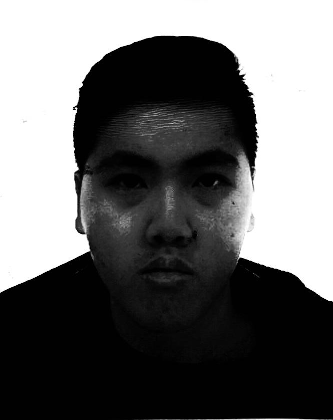
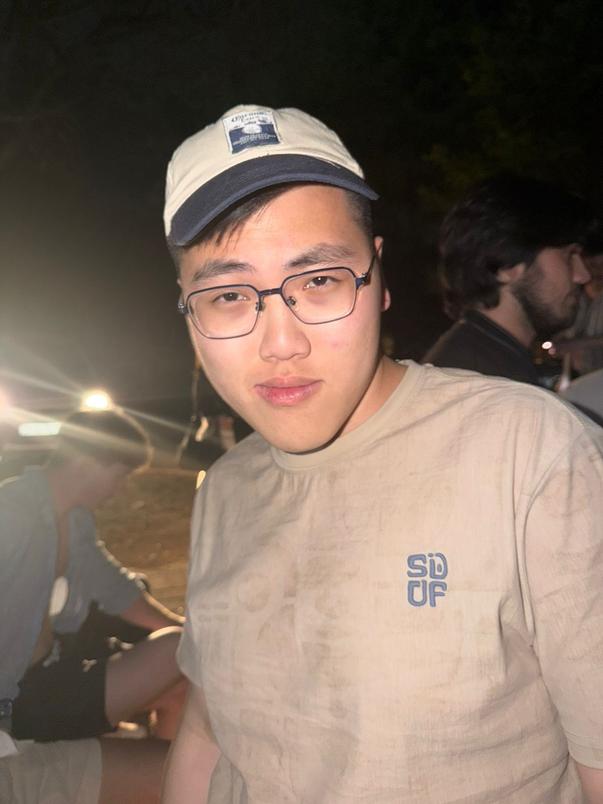
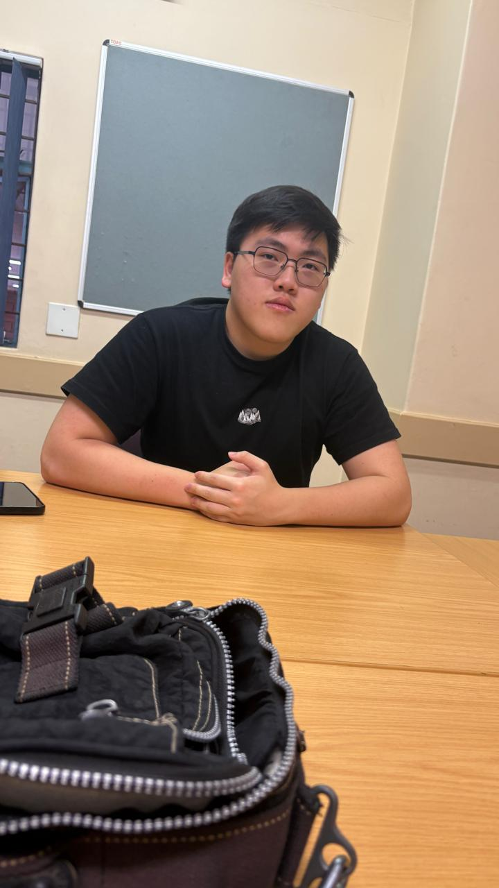
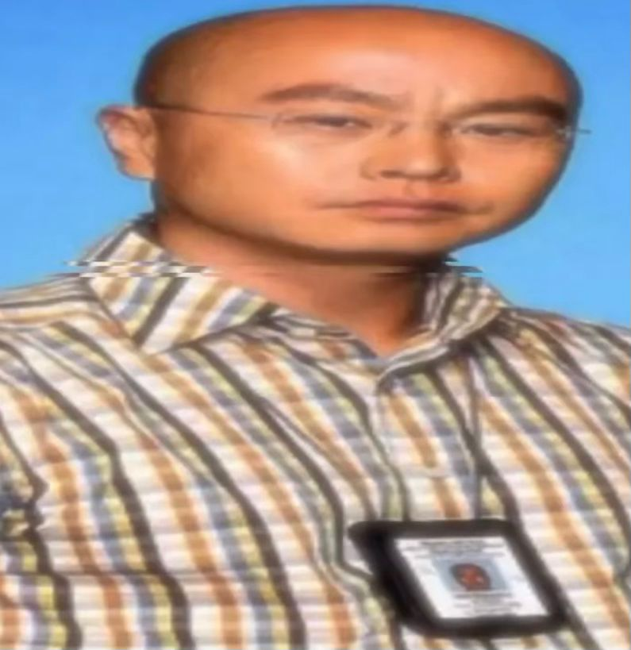

# COS 214 Project - NJD Films Greenhouse Management System


## Contents
- [Description](#description)
- [Documentation](#documentation)
- [Setup](#setup)
- [Team](#team)

## Description
The NJD Films Greenhouse Management System is a C++ project that simulates a comprehensive plant lifecycle management system using design patterns. The simulation manages plant creation, decoration, watering systems, staff functions, and store layout while demonstrating principles of software design such as scalability, flexibility, and maintainability.


*"Up the rah"*

## Documentation

### Project Documentation
- **[Documentation](Documents/)** - All the documentation you could need !

### UML Diagrams
- **[UML Diagrams](UMLs/)** - Design patterns and system architecture diagrams

## Setup

### Building and Running

#### Using CMake 
```bash
# Navigate to SystemFiles directory
cd SystemFiles

# Create and enter build directory
mkdir build
cd build

# Configure the project
cmake ..

# Build the project
cmake --build .
```

#### Running the Demo Main
```bash
# From the build dir
./COS_214_Project___NJD_Films          # Linux
.\COS_214_Project___NJD_Films.exe      # Windows
```

#### Running Unit Tests
```bash
# From the build dir
./GreenhouseSimulation                 # Linux
.\GreenhouseSimulation.exe             # Windows
```

#### Using Makefile
```bash
# Navigate to SystemFiles directory
cd SystemFiles

# Compile all targets
make all

# Run demo main
make run

# Run unit tests
make run-test

# remove all compiled files
make clean
```

## Team

| Profile | Member | Student Number | Roles | Description |
|---------|--------|---------------|-------|-------------|
| | Noah Dollenberg | u24596142 | Factory, Adapter, Communication Diagram, Powerpoint  | Not sure what I'm supposed to be doing here(I want that to be my description) |
|  | Dillon Koekemoer | u23537052 | Builder, Decorator, Plant, Unit Testing, Class Diagram, Attempt at the GUI | Who decided that? I will be the one to decide !  |
|  | Dylan McRobbie | u24646866 | State, Prototype, demo main, Sequence Diagram | You met me at a very strange time in my life -"Where is my mind?" starts playing |
|  | David Potgieter | u04579624 | Template, Strategy, functional requirements doc, Activity + State Diagram | You merely adopted the dark, I was born in it, molded by it  |
|  | Joshua Roberts | u23536765 | Composite, Iterator, Command, Class Diagram | TONIGHTS THE NIGHT |

